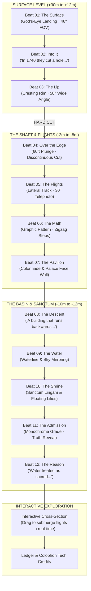
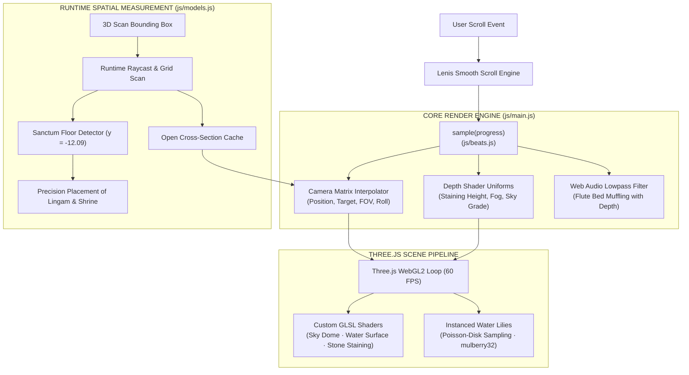

# BAOLI — बावड़ी

**A machine built to pull the sky underground.**

[](https://baoli-peach.vercel.app)
[](https://github.com/santoshcheethiralame-dot/BAOLI)
[](https://threejs.org/)
[](#verification--debugging)

A real-time 3D cinematic descent into **Toorji Ka Jhalra**, an 18th-century stepwell in Jodhpur, Rajasthan. You land on a god's-eye view of the excavation and scroll down through it — over the lip, past the criss-cross flights, along the pavilion wall, to a sacred shrine standing in the water at the bottom.

Everything runs live in the browser at 60 FPS. No pre-rendered video, no static frames, no build step.

---

## 📐 Architecture & Narrative Flow

Unlike traditional buildings that rise into the sky, a **baoli** is an inverted structure sunk 60 feet into the earth. The user's journey is a physical and acoustic descent from atmospheric open sky down to quiet, subterranean water.

### 1. Narrative & Camera Beat Sequence

The experience is structured as a 12-beat table defined in [`js/beats.js`](file:///c:/Users/carbo/projects/hackathons/baoli/js/beats.js), tracking continuous depth levels from surface to sanctum:



### 2. Runtime System & Rendering Pipeline



---

## 🏛️ What is Real, and What is Invented

This piece is a directed architectural interpretation rather than a dry archival document:

> [!NOTE]
> - **The well is real.** Built in the 1740s by the queen consort of Maharaja Abhay Singh, the scanned 3D mesh of Toorji Ka Jhalra preserves every real flight, bracket, jharokha, and chhatri.
> - **The stone color is algorithmic GLSL.** Photogrammetry scans carry no texture maps; every stone tone is synthesized via procedural height-based shaders (bleached at the rim, weathered at depth, algae-stained at the waterline).
> - **The shrine & lingam are composited.** There is no shrine at the bottom of the real pool. We placed a separate temple model in the water with a sacred lingam inside its sanctum.
> - **The water level is fixed.** Held at two-thirds depth to maintain maximum architectural readability.
> - **The admission.** Rather than hiding these decisions, the narrative explicitly reveals what is real and what is invented during the final camera beat.

---

## 🚀 Running Locally

No build step, no bundler, no node_modules required. Run any static HTTP server:

```bash
# Python 3
python -m http.server 8790
```

Then open [`http://127.0.0.1:8790/`](http://127.0.0.1:8790/) in your browser.

---

## 🛠️ Engineering Details

| System | Technology / Implementation | Source File |
|---|---|---|
| **Rendering** | Three.js (WebGL2) with custom GLSL shaders | [`js/main.js`](file:///c:/Users/carbo/projects/hackathons/baoli/js/main.js) |
| **Scroll Sync** | Lenis smooth scroll driving a 12-beat camera table | [`js/beats.js`](file:///c:/Users/carbo/projects/hackathons/baoli/js/beats.js) |
| **Shaders** | Custom GLSL: procedural height staining, water reflections, sky dome | [`js/water.js`](file:///c:/Users/carbo/projects/hackathons/baoli/js/water.js), [`js/sky.js`](file:///c:/Users/carbo/projects/hackathons/baoli/js/sky.js) |
| **Spatial Math** | Runtime mesh raycasting, centroid calculation, Poisson-disk sampling | [`js/models.js`](file:///c:/Users/carbo/projects/hackathons/baoli/js/models.js) |
| **Audio System** | Web Audio API: depth-modulated lowpass filter on ambient flute | [`js/ui.js`](file:///c:/Users/carbo/projects/hackathons/baoli/js/ui.js) |
| **Typography** | Bodoni Moda · Archivo · Space Mono | [`css/style.css`](file:///c:/Users/carbo/projects/hackathons/baoli/css/style.css) |
| **Asset Compression** | Draco GLTF encoding via `@gltf-transform/cli` (94 MB → 20 MB) | Assets in [`assets/`](file:///c:/Users/carbo/projects/hackathons/baoli/assets/) |

### Key Technical Breakthroughs

> [!IMPORTANT]
> **1. Camera Beat Table vs. Spline Curves**  
> A standard Catmull-Rom spline can only glide smoothly — it cannot hold, cut, or change lenses dynamically. BAOLI uses a 12-beat camera table where each frame lerps position, look-at target, roll angle, and focal length (from wide **58°** at the rim down to telephoto **30°** on the stair lattice to compress architecture into graphic pattern).

> [!TIP]
> **2. Runtime Measurement over Hardcoded Guesses**  
> The stepwell scan is highly asymmetric ($33.8\text{m} \times 31.1\text{m}$ at rim vs $15.6\text{m} \times 16.6\text{m}$ at waterline, with center offset by $\sim 3.5\text{m}$). The engine grids the model from above at runtime to find open air corridors, raycasts the sanctum floor at $y = -12.09$, and computes the true area-weighted pool centroid.

> [!WARNING]
> **3. Draco Geometry Compression**  
> Default 3D optimization pipelines run mesh simplification, which decimated sharp architectural stair edges. Compression was executed using **Draco geometry encoding only**, skipping vertex simplification entirely to keep crisp steps while reducing asset footprint by 78%.

> [!NOTE]
> **4. Organic Lotus Scatter (Poisson-Disk + Mulberry32)**  
> Water lilies on the pool surface use instanced rendering scattered via Poisson-disk sampling and a 32-bit PRNG (`mulberry32`), preventing artificial grid alignment or clumping near the camera corridor.

---

## 🧪 Verification & Debugging

Automated quality control via `scripts/verify.js` (Puppeteer + Chrome):
- **Jank Testing**: Measures per-frame `requestAnimationFrame` deltas against a p95/max threshold.
- **Dev URL Contracts**:
  - `?jump=<scrollY>` — Instantly lands at pre-scrolled depth once `window.__ready` fires.
  - `?cam=x,y,z,lx,ly,lz,fov` — Overrides camera for direct framing inspection.
  - `?nowater` / `?flatsky` / `?nolilies` — Disables specific render passes for debugging.

---

## 📜 Credits & License

| Asset | Origin | Source |
|---|---|---|
| **Toorji Ka Jhalra Scan** | Photogrammetry 3D Scan | Sketchfab |
| **Shrine Model** | Indian Temples Pack | Sketchfab |
| **Sanctum Lingam** | Lingam Essence | Sketchfab |
| **Origami Water Lilies** | Low-poly Plant Pack | Sketchfab |
| **Audio Bed** | Krishna Flute Recording | Krasnoshchok |

Built for the **3D Websites Hackathon**. Open source under the [MIT License](file:///c:/Users/carbo/projects/hackathons/baoli/LICENSE).
